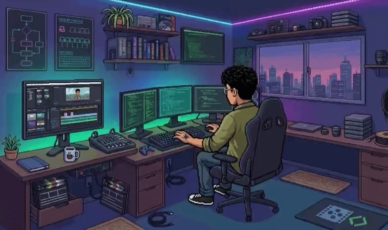

  

# Prazer, eu sou o Cauan! 👋 
### Mas como já temos intimidade, pode me chamar de **Morária**.

Sou um apaixonado por tecnologia e desenvolvimento de software. Meu foco é transformar ideias complexas em código limpo e interfaces que realmente funcionam. Além da mão na massa no código, atuo como Product Owner em projetos, garantindo que cada funcionalidade tenha um propósito real para o usuário final.

---

### 🛠️ O que eu domino (e o que estou aprendendo)
* **No Mobile:** Meu foco principal é Android, utilizando **Kotlin** e **Jetpack Compose** para criar experiências fluidas.
* **Na Web:** Domínio de HTML, CSS e JavaScript para interfaces responsivas.
* **Dados:** Atualmente mergulhado nos estudos de **MongoDB**, explorando o mundo dos bancos de dados NoSQL.
* **Base Técnica:** Lógica de programação sólida e constante evolução em algoritmos.

### 📈 O "Plus" na Estratégia e Criatividade
* **Gestão:** Organizo backlogs com **Scrum** e **Trello**, garantindo que as Sprints rodem sem gargalos.
* **UI/UX:** Tiro as ideias do papel no **Figma**, criando protótipos focados no usuário.
* **Audiovisual:** Também atuo com **edição de vídeos**, o que me ajuda a comunicar ideias e apresentar projetos de forma dinâmica.

---

### 🧪 No Lab (Ideias em Concepção)
Atualmente estruturando o GDD (Game Design Document) do **Pixel Hero**, um tributo aos clássicos de 8 e 16 bits para navegador. A premissa foca em evolução progressiva:
* 👟 **Agilidade:** Desbloqueio de verticalidade com *Iron Boots*.
* 🛡️ **Estratégia:** Combate à distância com o *Vibranium Shield*.
* 👊 **Ápice:** A transformação *Gamma Punch* para enfrentar o grande "The Bug Pixel".

### 📌 Projetos Concluídos/Ativos
* **Virtual Dream:** App mobile em Jetpack Compose para mapeamento de sonhos.
* **Hotel Abacaxi:** Sistema de gestão hoteleira via terminal desenvolvido em Kotlin.

---

### 📫 Bora trocar uma ideia?
Seja para falar de Kotlin, MongoDB, edição de vídeo ou sobre o futuro do *Pixel Hero*, é só chamar!

